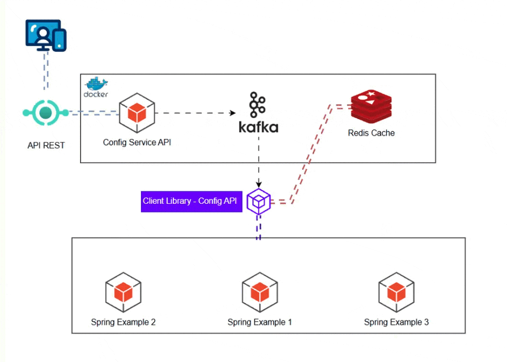

# Desafio Final - Sistema de Configuração Distribuída

## 🎯 O Problema

Você precisa construir um sistema que permite gerenciar configurações de aplicações de forma centralizada. As aplicações devem receber atualizações de configuração em tempo real, sem necessidade de restart.

## Arquitetura Esperada

## O que deve ser entregue

### 1. API de Configurações (Spring Boot)
- CRUD completo de configurações
- Organização por namespace + environment  
- Histórico de mudanças
- Autenticação básica

### 2. Sincronização Tempo Real
- Publique eventos no Kafka quando configurações mudarem
- Clientes devem receber e aplicar mudanças automaticamente
- Sincronização periódica como fallback

### 3. Performance & Disponibilidade  
- Use Redis para cache das configurações
- Aplicações devem funcionar mesmo se API estiver offline
- Tempo de resposta < 100ms para busca de configs

### 4. SDK/Biblioteca Cliente
- Integração transparente via Spring Boot
- Annotation para injetar configurações
- Auto-refresh quando configurações mudarem
- Cache local como fallback

### 5. Aplicação Demonstrativa
- Use seu próprio SDK para mostrar funcionamento
- Endpoints que demonstrem configurações sendo aplicadas em tempo real

## Stack Obrigatória

- Spring Boot + JPA + Security
- Apache Kafka  
- Redis
- Quartz Scheduler
- Docker + Docker Compose
- Testes (JUnit + Mockito)

##  Dicas Finais

- Pense em fallbacks - e se o Kafka cair?
- Cache é crítico - estratégia de invalidação?
- SDK deve ser simples de usar - como seria a API ideal?
- Logs estruturados vão te salvar no debug

**Lembre-se**: O objetivo é aplicar todas as tecnologias da trilha em um projeto real. Não existe solução única - use sua criatividade e conhecimento técnico.

Boa sorte! 🚀